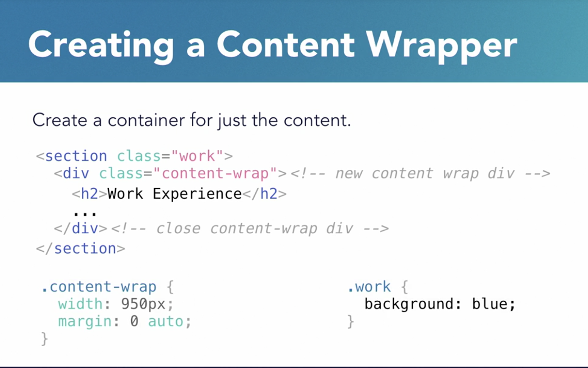

# [final goal](https://christinatruong.github.io/css-essential-training/css-portfolio/)

## optimize img

  * project thumbnails = 600 px width

  * background images = 1400 px to 2000 px width

Use content wrapper to make the background to span out entire width of the page.

